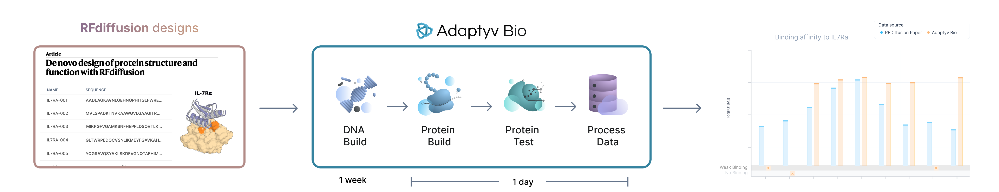

# Case Study: Benchmarking RFdiffusion generated binders for IL-7Ra

This repository houses the data generated during the RFdiffusion test case for validating the computational protein binder design pipeline developed by the Baker lab at the Institute for Protein Design for the IL-7Ra antigen.

## Contents
The data is structured as follows:
- "original_data": contains the data published on the RFDiffusion paper, including an additional kinetic report containing the kinetics and fitting provided by the Baker Lab.
- "affinity_characterization": contains the data generated by Adaptyv Bio for the experimental test case. The folder contains a summary of the kinetic data, figures containing the sensorgrams generated as well as the raw data.

## Experimental Procedures

### **RFdiffusion paper**

In the paper, they designed backbones for 1000 mini-binders using RFdiffusion by conditioning the model on the [***3D structure of IL-7Ra***](https://www.ebi.ac.uk/pdbe/pdbe-kb/proteins/P16871). For each of the binder structures generated, 2 sequences were designed using the ProteinMPNN inverse folding model. Finally, these sequences were folded using AlphaFold2 and the designs were filtered based on several computational metrics of the model (`pae_interaction < 10`). A detailed description of their methodology can be found in the [***Supporting Information**](https://static-content.springer.com/esm/art%3A10.1038%2Fs41586-023-06415-8/MediaObjects/41586_2023_6415_MOESM1_ESM.pdf)* of the paper. 

At the end, 95 designs were selected to be experimentally tested in the lab. The designs were expressed in E. Coli, purified and then their affinity to IL-7Ra was characterized in a binding assay using Biolayer Interferometry (BLI). The initial set of designs was pre-screened using a single concentration assay at a high analyte concentration (10 µM) to both strong and weak binding interactions. Sequences were rated as binding or not based on a cut-off (signal response equal to or greater than 50% of the positive control sequence). This way, they determined 32 sequences to be binding to the target. The top 20 best performing sequences (highest max loading in the screening experiment) were then further characterized using multi-cycle kinetics (MCK) experiments in BLI to calculate the protein-antigen dissociation constant (KD). This assay was performed across a range of 4 concentrations (5 µM to 40 nM) and the data was fitted using the Octet software with a 1:1 binding model.

### **Adaptyv Bio** - Affinity Characterization workflow

We selected 42 sequences from the paper (the 32 ones that were classified as binders and 10 randomly selected sequences from the ones that are categorized as non-binders). We designed DNA coding for the constructs and after receiving the gene fragments in our lab, we expressed the variants using our cell-free expression system. We performed expression quantification of the variants to ensure their correct synthesis and evaluated their binding affinity using our automated workflow with multi-cycle kinetics (MCK) characterization and processed and fitted the results using our data analysis pipeline. 

Instead of recombinant expression, we performed E. coli based cell-free expression and and manage to express high yields for all the selected variants (see expression data measured via BLI sensor loading). However, we did not perform any additional QC measurements of the binders to understand their monomeric state and ensure that they were not aggregated during the binding assay. Additionally compared to the paper we reversed the assay, i.e. we immobilized the RFdiffusion binders in the assay surface and flow in IL7RA as analyte. This makes it easier and faster to run. We performed the experiment at a maximum analyte concentration of 1 µM, which allows us to see KDs up to ~50 µM. 

In the paper, a protein is classified as `binding` if its maximum shift in the assay is above 50% of the maximum signal shift detected for the positive control. As the maximum shift can vary depending on several parameters including ligand density, we decided to select a threshold based on the maximum signal measured by the negative control. This is commonly used to detect association events for weak interactions and is preferable because it is not dependent on the binding and interaction signal of a positive control which might not exist for many protein engineering tasks. In this case we set up the threshold to be twice the maximum signal of the negative control at the highest concentration to ensure the significance of detection (0.066 nm).
